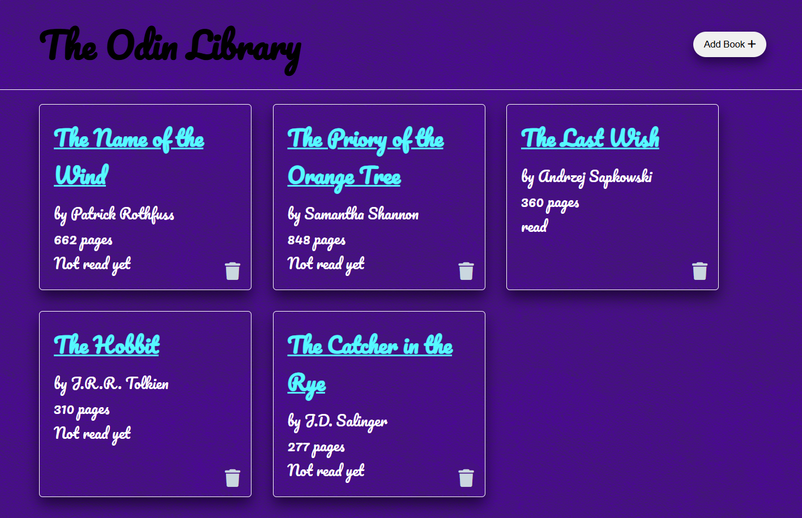

# Book Library Project  

A simple Book Library application built with JavaScript, HTML, and CSS. This project allows users to add, view, and manage a collection of books.  

## Features  
- Add new books with title, author, and status (read/unread).  
- View a list of books in the library.  
- Remove books from the library.  
- Toggle book status between "Read" and "Unread".  

## Live Demo  
[Click here to view the live demo](<https://mil9nn.github.io/Library/index.html>)  

## Technologies Used  
- JavaScript  
- HTML  
- CSS  

## How to Use  
1. Open the live demo link or clone the repository.  
2. Add book details using the form provided.  
3. Manage your book list directly in the application interface.  

## Screenshots  

*The main interface of the Book Library application.*

*The popup form for adding a new book to the library.*

## Future Enhancements  
- Persistent storage using localStorage or a database.  
- Add a search and filter feature for the library.  
- Include book cover images.  

## License  
This project is open source and available under the MIT License.  
